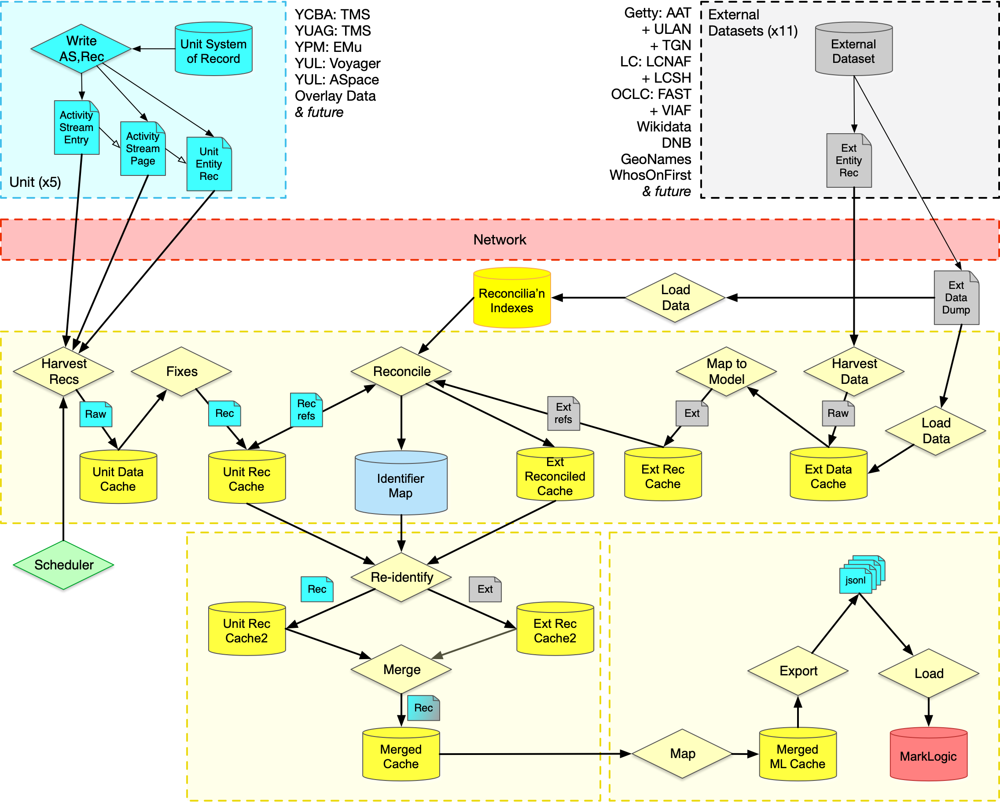

# Data Transformation Pipeline Code

## Architecture

## Pipeline Components

### Future ITS Owned Components:
* Harvester: ActivityStreams based record harvester that stores to a Cache.
* Cache:  Record cache for storing local copies of JSON data. Currently postgres or filesystem.
* IdMap: Identifier Map that mints, manages and retrieves external/internal identifier sets. Currently redis or in-memory.

### Pipeline Components:

* Config: Configuration as JSON records in a Cache.
* Collector: Recursively collects identifiers for a given record.
* Merger: Merges two Linked Art records representing the same entity together.
* Reidentifier: Recursively external rewrite URIs in a record to internal identifiers, given an IdMap.
* Sources/\*/Fetcher: Fetches identified record from external source to a Cache.
* Sources/\*/Mapper: Maps from external source into Linked Art.
* Sources/\*/Reconciler: Determine if the entity in the given record is described in the external source.
* Sources/\*/Loader: Load a dump of the data into the data cache.
* Sources/\*/IndexLoader: Create an inverted index to reconcile records against this dataset.
* MarkLogic: Transformation from Linked Art into MarkLogic internal format.

## External Sources: Implementation Status

| Source          | Fetch | Map | Reconcile | Load | IdxLoad |
| --------------- | ----- | --- | --------- | ---- | ------- |
| AAT             |   ✅  |  ✅ |   N/A     | N/A  | -       | 
| DNB             |   ✅  |  ✅ |     -     |  ✅  | -       | 
| FAST            |   ✅  |  -  |     -     |  -   | -       | 
| Geonames        |   ✅  |  ✅ |     -     | N/A  | -       | 
| LCNAF           |   ✅  |  ✅ |     -     |  -   | -       | 
| LCSH            |   ✅  |  ✅ |     -     |  ✅  | ✅      | 
| TGN             |   ✅  |  ✅ |     -     | N/A  | -       | 
| ULAN            |   ✅  |  ✅ |     -     | N/A  | -       | 
| VIAF            |   ✅  |  ✅ |     -     |  -   | -       | 
| Who's on First  |   ✅  |  ✅ |     -     | N/A  | -       | 
| Wikidata        |   ✅  |  ✅ |     ✅    |  ✅  | ✅      | 
| Japan NL        |   ✅  |  ✅ |     -     | N/A  | -       |

✅ = Seems to work ; - = Not started ; N/A = Can't be done

* AAT, TGN, ULAN: Dump files are NTriples based. More effort to reconstruct than it would be worth. 
* Geonames: Dump file is CSV without all the information (e.g. no language of names)
* WOF: Dump file is a 33Gb sqlite db... if it was useful, we could just use it as the cache
* LCNAF: Doesn't have the real world object data which we want, useful for reconciliation though
* VIAF: Too much data for not enough value
* FAST: Just not implemented yet (needs to process MARC/XML)

### Fetching external source dump files

Process:
1. In the config file, look up `dumpFilePath` and `remoteDumpFile`
2. Go to the directory where `dumpFilePath` exists and rename it with a date (e.g. latest-2022-07)
3. execute `wget <url>` where `<url>` is the URL from `remoteDumpFile` (and probably validate it by hand online)
4. For wikidata, as it's SO HUGE, instead do:  `nohup wget --quiet <url> &` to fetch it in the background so we can get on with our lives in the mean time.
5. Done :) 

